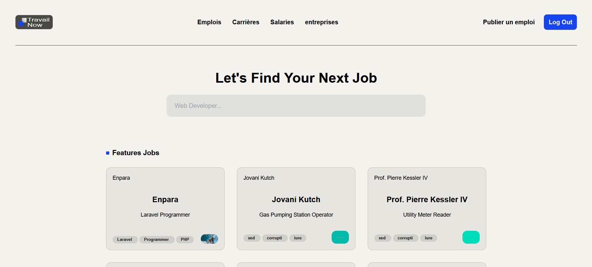
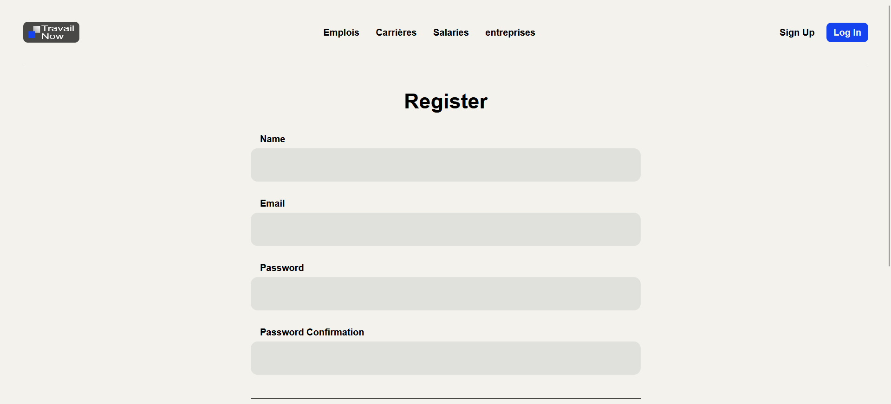

# Travail Now

**Travail Now** is a web application designed for job management, allowing users to sign up, log in, and interact with Jobs seamlessly. This project demonstrates my ability to build robust backend systems and implement user authentication using **PHP Laravel** and **SQLite**.

## Features

-   **User Authentication**: Secure login, registration, and session management using Laravel's built-in authentication scaffolding.
-   **Task Management**: Core functionalities to create, edit, and delete Jobs.
-   **Blade Templating**: A clean, responsive user interface built using Laravel Blade templates.
-   **Lightweight Database**: SQLite used for simplicity and fast setup.

## Technologies Used

-   **Framework**: Laravel (PHP)
-   **Frontend**: Blade Templating Engine, HTML5, Tailwind CSS
-   **Backend**: Laravel's MVC architecture
-   **Database**: SQLite
-   **Version Control**: Git

## Screenshots

-   **Home Page**:
    
-   **Login Page**:
    

## Installation

To set up and run this project locally, follow these steps:

### Prerequisites

-   PHP >= 8.0
-   Composer
-   SQLite
-   Laravel CLI

### Steps

1. Clone the repository:
    ```bash
    git clone https://github.com/Raderne/php-travail-now
    ```
2. Navigate to the project directory:
    ```bash
    cd travail-now
    ```
3. Install dependencies:
    ```bash
    composer install
    npm install
    ```
4. Create a `.env` file by copying the example:
    ```bash
    cp .env.example .env
    ```
5. Generate an application key:
    ```bash
    php artisan key:generate
    ```
6. Set up the SQLite database:
    - Create a `database` directory if it doesn’t exist:
        ```bash
        mkdir database
        ```
    - Create an SQLite database file:
        ```bash
        touch database/database.sqlite
        ```
    - Update your `.env` file to set the database connection to SQLite:
        ```
        DB_CONNECTION=sqlite
        DB_DATABASE=/full/path/to/database.sqlite
        ```
7. Run database migrations:
    ```bash
    php artisan migrate
    ```
8. Start the development server:
    ```bash
    php artisan serve
    ```
    if you are using Laravel Herd, you can use the following command:
    ```bash
    php artisan serve --host=travail-now.test
    ```
9. Open your browser and go to `http://localhost:8000` or `http://travail-now.test` to view the application.

## Usage

-   **Register**: Create an account to start using the platform.
-   **Login**: Log in with your credentials to access the dashboard.
-   **Jobs Management**: Perform CRUD operations on Jobs.

## Project Structure

-   **Controllers**: Handle the logic for user authentication and task management.
-   **Blade Templates**: Define the structure and layout of the UI.
-   **Routes**: Managed in `web.php` to define application endpoints.
-   **Database**: SQLite for lightweight and fast operations.

## Contact

If you have any questions or would like to connect, feel free to reach out via [email](relmarzouki@gmail.com) or [LinkedIn](https://www.linkedin.com/in/reda-elmarzouki-98a89ba0/).
